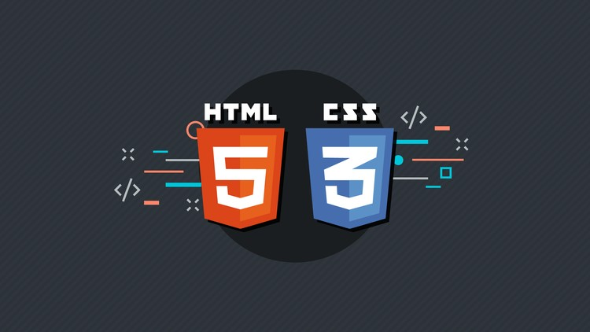

## Html & Css - Curso Em Video :books:

```
Repositório para salvar arquivos do curso de Html e Css 2020
```



---

Caso queira usa-lo para estudo fique avontade :)


- [html-css/aulas-pdf at master · gustavoguanabara/html-css · GitHub](https://github.com/gustavoguanabara/html-css/tree/master/aulas-pdf)

- [Novo curso HTML5 e CSS3: 100% atual - YouTube](https://www.youtube.com/playlist?list=PLHz_AreHm4dkZ9-atkcmcBaMZdmLHft8n)

- https://www.instagram.com/gustavoguanabara/

- https://www.instagram.com/cursoemvideo/

- Acima os links para você buscar o conteudo original
